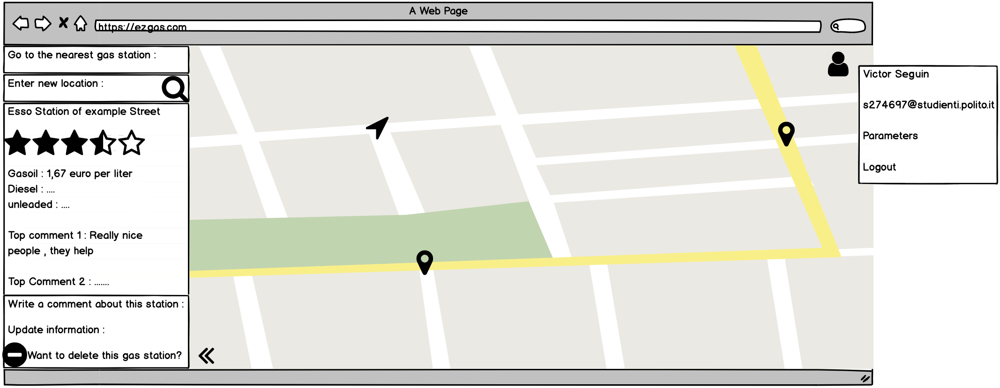

# Graphical User Interface Prototype  

Authors:
- SEGUIN Victor
- LEPORI Alessandro
- QUARTA Federico
- GIROLAMI Silvio

Date: 13/04/2020

Version: 1.0

#GUI

Template website is displayed with balsamiq UI

The main screen is here : 
- UC1
- UC5

The main screen without login : 
- UC4
- UC5

This menu is displayed when you click on a station or search a specific station : 
- UC8

This menu is displayed when you want to list all the stations : 
- UC14
- UC15

Then, here are displayed the different forms to update and create Gas Stations : 

Create : 
- UC9

Update : 
- UC11

