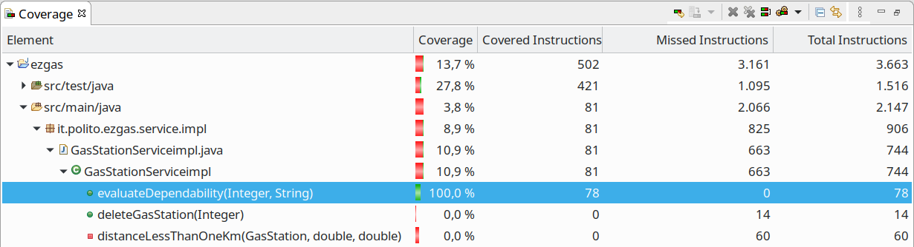
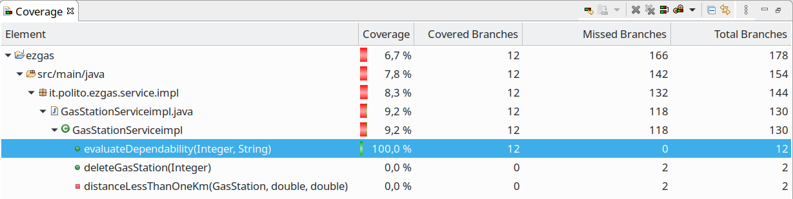

# Unit Testing Documentation

Authors: Federico Quarta, Victor Seguin, Alessandro Lepori, Silvio Girolami 

Date: 18/05/2020

Version: 1.0

# Contents

- [Black Box Unit Tests](#black-box-unit-tests)

- [White Box Unit Tests](#white-box-unit-tests)

# Black Box Unit Tests

 ### **Class *GasServiceimpl* - method *evaluateDependability***

**Criteria for method *evaluateDependability*:**
	

 - Value of reputation
 - Well formed number for timestamp
 - Sign of the timestamp
 - Value of timestamp
 - Days between timestamp and currentTime 

**Predicates for method *evaluateDependability*:**

| Criteria            | Predicate |
| ------------------- | --------- |
| Value of reputation | = NULL    |
|                     | = [minint, -5) |
|                     | = [-5, 0)      |
|                     | = [0, +5]      |
|                     | = (+5, maxint] |
| Well formed number for timestamp  | = YES |
|                                   | = NO  |
| Value of the timestamp | = NULL |
|                        | = (-inf, minlong) |
|                        | = [minlong, maxlong] |
|                        | = (maxlong, +inf) |
| Sign of the timestamp  | = NEGATIVE |
|                        | = POSITIVE |
| Days between timestamp and currentTime  | = [minint, 0) |
|                                         | = [0, 7] |
|                                         | = (7, maxint] |

**Boundaries**:

| Criteria | Boundary values |
| ------------------- | --------- |
| Value of reputation | = -6 |
|                     | = -5 |
|                     | = +5 |
|                     | = +6 |
| Days between timestamp and currentTime  | = -1 |
|                                         | = 0 |
|                                         | = 6 |
|                                         | = 7 |
|                                         | = 8 |

**Combination of predicates**:

| Value of reputation | Well formed number for timestamp | Value of timestamp | Sign of the timestamp | Days between timestamp and currentTime | Valid / Invalid | Description of the test case | JUnit test case |
|-------|-------|-------|-------|-------|-------|-------|-------|
| NULL | - | - | - | - | Invalid | evaluateDependability(null, "25658965")->-1 | EZGasGasStationServiceTest.testEvaluateDependability1 |
| [minint, -5) | - | - | - | - | Invalid | evaluateDependability(-6, "25658965")->-1 | EZGasGasStationServiceTest.testEvaluateDependability2 |
| [-5, 0) | NO | - | - | - | Invalid | evaluateDependability(-3, "ad2d65")->-1 | EZGasGasStationServiceTest.testEvaluateDependability4 |
| [-5, 0) | YES | NULL | - | - | Invalid | evaluateDependability(-3, null)->-1 | EZGasGasStationServiceTest.testEvaluateDependability3 |
| [-5, 0) | YES | (-inf, minlong) | - | - | Invalid | evaluateDependability(-3, "-999999999999999999999999")->-1 | EZGasGasStationServiceTest.testEvaluateDependability20 |
| [-5, 0) | YES | (maxlong, +inf) | - | - | Invalid | evaluateDependability(-3, "999999999999999999999999")->-1 | EZGasGasStationServiceTest.testEvaluateDependability6 |
| [-5, 0) | YES | [minlong, maxlong] | NEGATIVE | - | Invalid | evaluateDependability(-3, "-25658965")->-1 | EZGasGasStationServiceTest.testEvaluateDependability5 |
| [-5, 0) | YES | [minlong, maxlong] | POSITIVE | [minint, 0) | Invalid | evaluateDependability(-1, Long.toString(TODAY+1DAY)->-1 | EZGasGasStationServiceTest.testEvaluateDependability7 |
| [-5, 0) | YES | [minlong, maxlong] | POSITIVE | [0, 7] | Valid | evaluateDependability(-5, Long.toString(TODAY-7DAYS))->0 evaluateDependability(-3, Long.toString(TODAY))->60.0 evaluateDependability(-5, Long.toString(TODAY-6DAYS)->7.14 | EZGasGasStationServiceTest.testEvaluateDependability8, EZGasGasStationServiceTest.testEvaluateDependability9, EZGasGasStationServiceTest.testEvaluateDependability22 |
| [-5, 0) | YES | [minlong, maxlong] | POSITIVE | (7, maxint] | Valid | evaluateDependability(-3, Long.toString(TODAY-8DAYS))->10 | EZGasGasStationServiceTest.testEvaluateDependability10 |
| [0, +5] | NO | - | - | - | Invalid | evaluateDependability(+2, "ad2d65")->-1 | EZGasGasStationServiceTest.testEvaluateDependability13 |
| [0, +5] | YES | NULL | - | - | Invalid | evaluateDependability(+4, null)->-1 | EZGasGasStationServiceTest.testEvaluateDependability12 |
| [0, +5] | YES | (-inf, minlong) | - | - | Invalid | evaluateDependability(+3, "-999999999999999999999999")->-1 | EZGasGasStationServiceTest.testEvaluateDependability21 |
| [0, +5] | YES | (maxlong, +inf) | - | - | Invalid | evaluateDependability(+3, "999999999999999999999999")->-1 | EZGasGasStationServiceTest.testEvaluateDependability15 |
| [0, +5] | YES | [minlong, maxlong] | NEGATIVE | - | Invalid | evaluateDependability(+5, "-1")->-1 | EZGasGasStationServiceTest.testEvaluateDependability14 |
| [0, +5] | YES | [minlong, maxlong] | POSITIVE | [minint, 0) | Invalid | evaluateDependability(+5, Long.toString(TODAY+1DAY))->-1 | EZGasGasStationServiceTest.testEvaluateDependability16 |
| [0, +5] | YES | [minlong, maxlong] | POSITIVE | [0, 7] | Valid | evaluateDependability(+5, Long.toString(TODAY-7DAYS))->50 evaluateDependability(+3, Long.toString(TODAY))->90 evaluateDependability(+5, Long.toString(TODAY-6DAYS))->57.14| EZGasGasStationServiceTest.testEvaluateDependability17, EZGasGasStationServiceTest.testEvaluateDependability18, EZGasGasStationServiceTest.testEvaluateDependability23 |
| [0, +5] | YES | [minlong, maxlong] | POSITIVE | (7, maxint] | Valid | evaluateDependability(+4, Long.toString(TODAY-8DAYS))->45 | EZGasGasStationServiceTest.testEvaluateDependability19 |
| (+5, maxint) | - | - | - | - | Invalid | evaluateDependability(+6, "25658965")->-1 | EZGasGasStationServiceTest.testEvaluateDependability11 |

# White Box Unit Tests

### Test cases definition

| Unit name | JUnit test case |
|--|--|
| GasServiceimpl.evaluateDependability | EZGasGasStationServiceTest.testEvaluateDependability1 |
| GasServiceimpl.evaluateDependability | EZGasGasStationServiceTest.testEvaluateDependability2 |
| GasServiceimpl.evaluateDependability | EZGasGasStationServiceTest.testEvaluateDependability3 |
| GasServiceimpl.evaluateDependability | EZGasGasStationServiceTest.testEvaluateDependability4 |
| GasServiceimpl.evaluateDependability | EZGasGasStationServiceTest.testEvaluateDependability5 |
| GasServiceimpl.evaluateDependability | EZGasGasStationServiceTest.testEvaluateDependability6 |
| GasServiceimpl.evaluateDependability | EZGasGasStationServiceTest.testEvaluateDependability7 |
| GasServiceimpl.evaluateDependability | EZGasGasStationServiceTest.testEvaluateDependability8 |
| GasServiceimpl.evaluateDependability | EZGasGasStationServiceTest.testEvaluateDependability9 |
| GasServiceimpl.evaluateDependability | EZGasGasStationServiceTest.testEvaluateDependability10 |
| GasServiceimpl.evaluateDependability | EZGasGasStationServiceTest.testEvaluateDependability11 |
| GasServiceimpl.evaluateDependability | EZGasGasStationServiceTest.testEvaluateDependability12 |
| GasServiceimpl.evaluateDependability | EZGasGasStationServiceTest.testEvaluateDependability13 |
| GasServiceimpl.evaluateDependability | EZGasGasStationServiceTest.testEvaluateDependability14 |
| GasServiceimpl.evaluateDependability | EZGasGasStationServiceTest.testEvaluateDependability15 |
| GasServiceimpl.evaluateDependability | EZGasGasStationServiceTest.testEvaluateDependability16 |
| GasServiceimpl.evaluateDependability | EZGasGasStationServiceTest.testEvaluateDependability17 |
| GasServiceimpl.evaluateDependability | EZGasGasStationServiceTest.testEvaluateDependability18 |
| GasServiceimpl.evaluateDependability | EZGasGasStationServiceTest.testEvaluateDependability19 |
| GasServiceimpl.evaluateDependability | EZGasGasStationServiceTest.testEvaluateDependability20 |
| GasServiceimpl.evaluateDependability | EZGasGasStationServiceTest.testEvaluateDependability21 |
| GasServiceimpl.evaluateDependability | EZGasGasStationServiceTest.testEvaluateDependability22 |
| GasServiceimpl.evaluateDependability | EZGasGasStationServiceTest.testEvaluateDependability23 |

### Code coverage report
#### Statement coverage

#### Branch coverage

### Loop coverage analysis

GasServiceimpl.evaluateDependability does not contain loops
<!---
|Unit name | Loop rows | Number of iterations | JUnit test case |
|---|---|---|---|
|||||
|||||
||||||
-->

